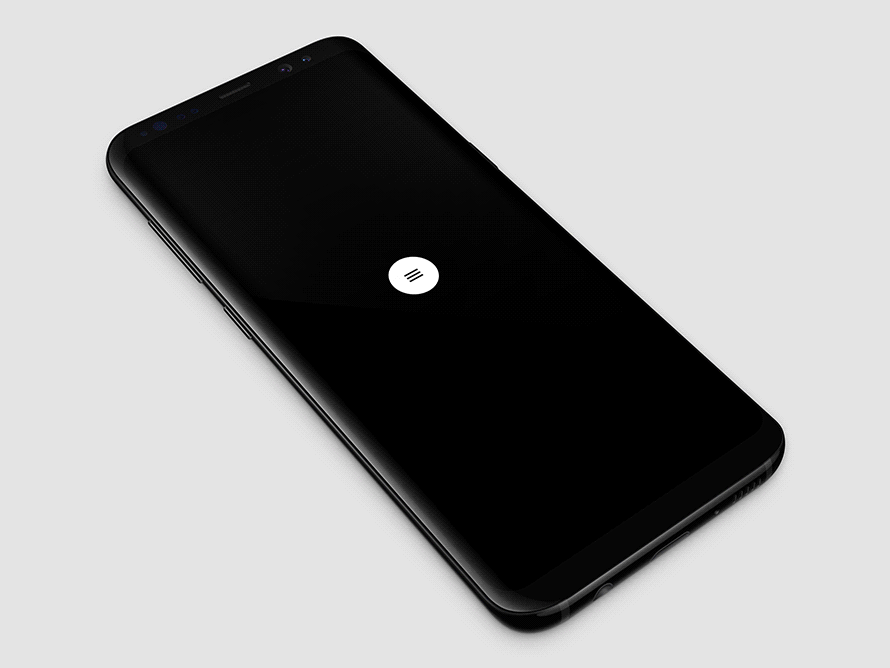

[](https://ramotion.com?utm_source=gthb&utm_medium=special&utm_campaign=circle-menu-android-logo)


# CircleMenu for Android
[](http://twitter.com/Ramotion)
[](https://www.codacy.com/app/dvg4000/circle-menu-android?utm_source=github.com&amp;utm_medium=referral&amp;utm_content=Ramotion/circle-menu-android&amp;utm_campaign=Badge_Grade)

# Check this library on other platforms:
<a href="https://github.com/Ramotion/circle-menu"> 
</a>
<a href="https://github.com/Ramotion/react-native-circle-menu"> 
</a>


**Looking for developers for your project?** 

<a href="https://ramotion.com?utm_source=gthb&utm_medium=special&utm_campaign=circle-menu-android-contact-us/#Get_in_Touch" > </a>


The [Android mockup](https://store.ramotion.com/product/samsung-galaxy-s8-mockups?utm_source=gthb&utm_medium=special&utm_campaign=circle-menu-android) available [here](https://store.ramotion.com/product/samsung-galaxy-s8-mockups?utm_source=gthb&utm_medium=special&utm_campaign=circle-menu-android).

## Requirements
​
- Android 4.1 Jelly Bean (API lvl 16) or greater
- Your favorite IDE

## Installation
​
Just download the package from [here](http://central.maven.org/maven2/com/ramotion/circlemenu/circle-menu/0.3.1/circle-menu-0.3.1.aar) and add it to your project classpath, or just use the maven repo:

Gradle:
```groovy
compile 'com.ramotion.circlemenu:circle-menu:0.3.1'
```
SBT:
```scala
libraryDependencies += "com.ramotion.circlemenu" % "circle-menu" % "0.3.1"
```
Maven:
```xml
<dependency>
	<groupId>com.ramotion.circlemenu</groupId>
	<artifactId>circle-menu</artifactId>
	<version>0.3.1</version>
</dependency>
```
​

## Basic usage

Place the `CircleMenuView` in your layout and set the icons and colors of the buttons, as shown below.
```xml
app:button_colors="@array/colors"
app:button_icons="@array/icons"
```

Example of arrays `colors` and `icons` in `res\values\buttons.xml`:
```xml
<?xml version="1.0" encoding="utf-8"?>
<resources>
    <array name="icons">
        <item>@drawable/ic_home_white_24dp</item>
        <item>@drawable/ic_search_white_24dp</item>
        <item>@drawable/ic_notifications_white_24dp</item>
        <item>@drawable/ic_settings_white_24dp</item>
        <item>@drawable/ic_place_white_24dp</item>
    </array>
    <array name="colors">
        <item>@android:color/holo_blue_light</item>
        <item>@android:color/holo_green_dark</item>
        <item>@android:color/holo_red_light</item>
        <item>@android:color/holo_purple</item>
        <item>@android:color/holo_orange_light</item>
    </array>
</resources>
```

Or use the constructor
```java
CircleMenuView(@NonNull Context context, @NonNull List<Integer> icons, @NonNull List<Integer> colors)
```
to add `CircleMenuView` and configure the buttons programmatically (in the code).

Next, connect the event handler `CircleMenuView.EventListener` as shown below,
and override the methods you need.

```java
final CircleMenuView menu = (CircleMenuView) findViewById(R.id.circle_menu);
menu.setEventListener(new CircleMenuView.EventListener() {
    @Override
    public void onMenuOpenAnimationStart(@NonNull CircleMenuView view) {
        Log.d("D", "onMenuOpenAnimationStart");
    }

    @Override
    public void onMenuOpenAnimationEnd(@NonNull CircleMenuView view) {
        Log.d("D", "onMenuOpenAnimationEnd");
    }

    @Override
    public void onMenuCloseAnimationStart(@NonNull CircleMenuView view) {
        Log.d("D", "onMenuCloseAnimationStart");
    }

    @Override
    public void onMenuCloseAnimationEnd(@NonNull CircleMenuView view) {
        Log.d("D", "onMenuCloseAnimationEnd");
    }

    @Override
    public void onButtonClickAnimationStart(@NonNull CircleMenuView view, int index) {
        Log.d("D", "onButtonClickAnimationStart| index: " + index);
    }

    @Override
    public void onButtonClickAnimationEnd(@NonNull CircleMenuView view, int index) {
        Log.d("D", "onButtonClickAnimationEnd| index: " + index);
    }
});
```

You can use `open(boolean animate)` and `close(boolean animate)` methods,
to open and close menu programmatically

Here are the attributes you can specify through XML or related setters:
* `button_icons` - Array of buttons icons.
* `button_colors` - Array of buttons colors.
* `icon_menu` - Menu default icon.
* `icon_close` - Menu closed icon.
* `icon_color` - Menu icon color.
* `duration_ring` - Ring effect duration.
* `duration_open` - Menu opening animation duration.
* `duration_close` - Menu closing animation duration.
* `distance` - Distance between center button and buttons

## License
​
CircleMenu for Android is released under the MIT license.
See [LICENSE](./LICENSE) for details.

# Get the Showroom App for Android to give it a try
Try our UI components in our mobile app. Contact us if interested.

<a href="https://play.google.com/store/apps/details?id=com.ramotion.showroom" >
</a>
<a href="https://ramotion.com/?utm_source=gthb&utm_medium=special&utm_campaign=circle-menu-android-contact-us/#Get_in_Touch"> 
</a>
<br>
<br>

## Follow us

[](https://twitter.com/intent/tweet?text=https://github.com/Ramotion/circle-menu-android)
[](https://twitter.com/ramotion)
